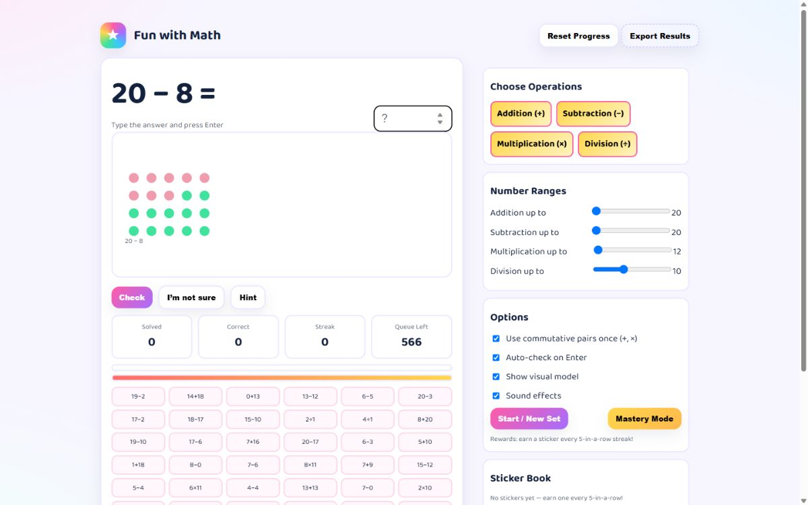

# ➕ Fun With Math

Math-fact practice that actually keeps kids going: pick the operations, drill the facts, earn a sticker every five in a row. Mastery mode re-queues anything they missed.

**Live:** [riffcode.brianriffle.com/apps/fun-with-math/](http://riffcode.brianriffle.com/apps/fun-with-math/)

## Built with

- Claude Code
- SVG
- Web Audio

Static HTML/CSS/JS — open `index.html` in a browser, no build step.

---

Part of [Riff Code](../../../README.md).
