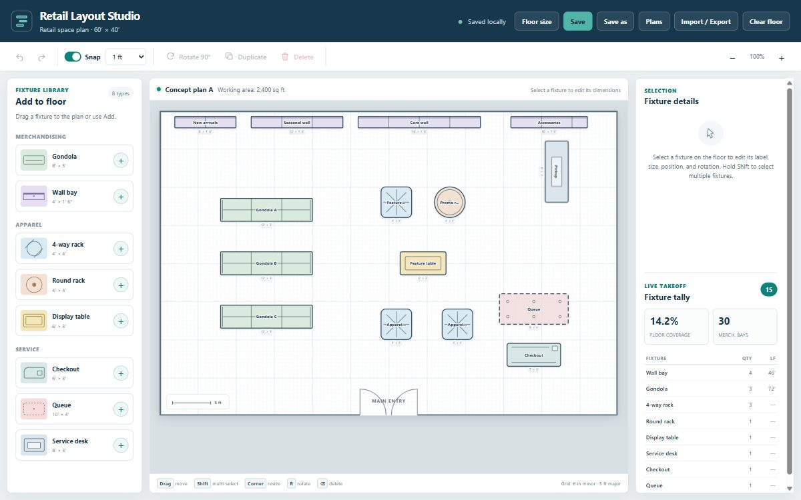

# 🗺️ Retail Layout Creator 2

The second pass at the store planner: resize the floor itself, select and move fixtures as a group, keep a library of named plans, and export the finished layout as a PNG.

**Live:** [riffcode.brianriffle.com/apps/retail-layout-creator-2/](http://riffcode.brianriffle.com/apps/retail-layout-creator-2/)

## Built with

- Claude Code
- SVG
- Vanilla JS

Static HTML/CSS/JS — open `index.html` in a browser, no build step.

---

Part of [Riff Code](../../../README.md).
