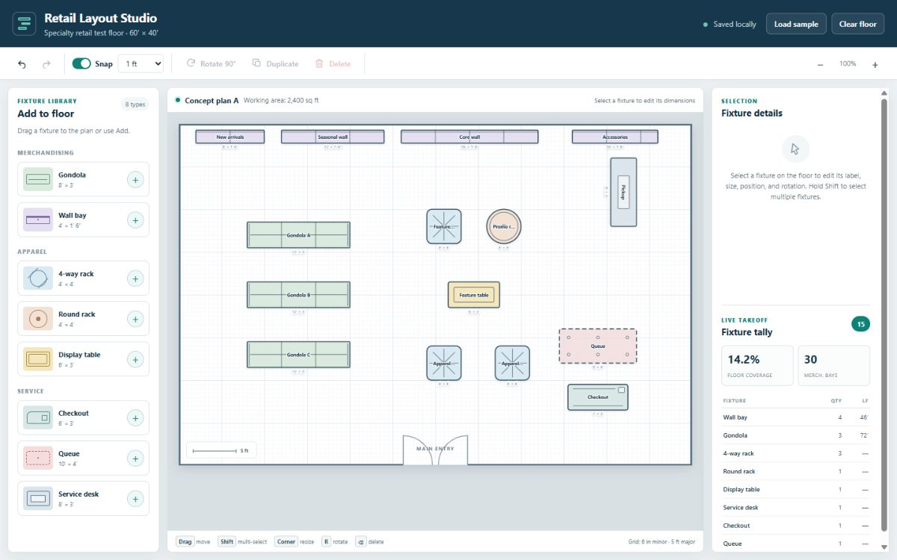

# 📐 Retail Layout Studio

A space-planning canvas for a 60′ × 40′ store floor. Drag in gondolas, racks and checkouts, resize them to the inch, and watch the fixture tally and floor coverage update live.

**Live:** [riffcode.brianriffle.com/apps/retail-layout-studio/](http://riffcode.brianriffle.com/apps/retail-layout-studio/)

## Built with

- Claude Code
- SVG
- Vanilla JS

Static HTML/CSS/JS — open `index.html` in a browser, no build step.

---

Part of [Riff Code](../../../README.md).
